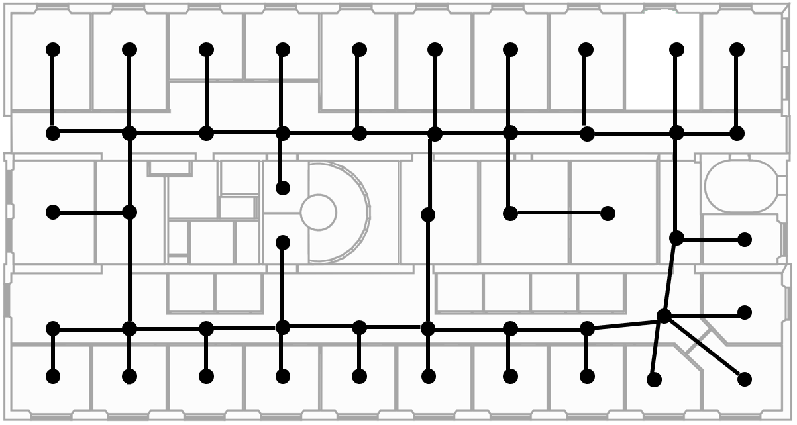

# Robust MITL planning under uncertain navigation times

mitl_task_solver_temporal_robustness is a Python library that computes strategies from Metric Interval Temporal Logic specifications, with an underlying Weighted Transition System or Markov Decision Process model of the environments, using Mixed Integer Linear Programming.


## Introduction

In environments like offices, the duration of a robot's navigation between two locations may vary over time. For instance, reaching a kitchen may take more time during lunchtime since the corridors are crowded with people heading the same way. 

We address the problem of routing in such environments with tasks expressed in Metric Interval Temporal Logic (MITL), a rich robot task specification language that allows to capture explicit time requirements. 
We want to find a strategy/plan that maximizes the temporal robustness of the robot's MITL task. 

As the first step towards a solution, we define a Linear Programming approach to solving the task planning problem over a Varying Weighted Transition System, where navigation durations are deterministic but vary depending on the time of day. 

Then, we apply this planner to optimize for MITL temporal robustness in Markov Decision Processes, where the navigation durations between physical locations are uncertain, but the time-dependent distribution over possible delays is known. Finally, we develop a receding horizon planner for Markov Decision Processes that preserves guarantees over MITL temporal robustness.


## Downloading sources

You can use this API by cloning this repository:
```
$ git clone https://github.com/KTH-RPL-Planiacs/mitl_task_solver_temporal_robustness.git
```

Dependencies:
* Python 3
	* Pulp
* Gurobi MILP Solver


## MTL

The module `MTL.py` implements the formalism of MTL Formulae.
It supports several boolean (Conjunction, Disjunction, Negation) and temporal operators (Until, Always, Eventually).


### True and False boolean constants

```
t = MTLFormula.TrueF()
f = MTLFormula.FalseF()
```


### Predicate

```
kitchen = MTLFormula.Predicate('K')
```
is an MITL Formula, where the constructor takes 1 arguments:
* `predicate`: the predicate's name (ex: `'K'`), that has to match 


### Conjunction and Disjunction

```
c = MTLFormula.Conjunction(list_formulas)
d = MTLFormula.Disjunction(list_formulas)
```
are MITL Formulae respectively representing the Conjunction and Disjunction of several MITL Formulae in `list_formulas`, where `list_formulas` is a list of MITL Formulae.


### Negation

```
n = MTLFormula.Negation(phi)
```
is an MITL Formula representing the negation of an MITL Formula `phi`.


### Temporal operators Until, Always and Eventually

```
u = MTLFormula.Until(phi1,phi2,t1,t2)
a = MTLFormula.Always(phi,t1,t2)
e = MTLFormula.Eventually(phi,t1,t2)
```
are MITL Formulae respectively representing the Until, Always and Eventually temporal operators. They takes the following arguments:
* `phi1`: an MITL formula
* `phi2`: an MITL formula (for the Until operator only)
* `t1`: lower time interval bound
* `t2`: upper time interval bound


## WTS and MDPs

The module `WTS.py` implements the formalism of a Weighted Transition System with dynamic weights. It takes the following arguments:
* `S`: the set of states
* `s_0`: the initial state
* `T`: the transitions
* `AP`: the atomic predicates
* `L`: the labelling function, returning for each state, its set of labels
* `C`: the weight function. For instance, `C[('s_5_1',50,'s_5_2')] = 3` means that it takes 3 time units to transit between `'s_5_1'` and `'s_5_2'` a time `t=50`.


In a similar fashion, `MDP_Object.py` and `MDP_examples.py` implement the MDPs related function, among which timed MDPs (function `construct_timed_MDP`) and history MDPs (function `construct_history_MDP`) that include time and history of visited states, in the state space. 


## MTLTaskAllocSolver and MTLTaskAllocSolver_MDP2

The function `generate_plan_mtl_wts(Demands,wts,PLANNING_HORIZON)` returns a plan/strategy, and takes 3 arguments:
* `Demands`: a list of tuples, (`mitl_formula`,`priority`) assigning to each MITL demand a priority
* `wts`: the WTS abstraction of the environment
* `PLANNING_HORIZON`: the planning horizon (should be greater than the demands' horizon)

The `MTLTaskAllocSolver_MDP2` class does so for the MDP model of the environment.


## Experiments

In a simulation of an office-like environment, we ran several experiments to show the scalability of our method:



See folder `experiments_wts` and `experiments_mdp` for details on the model, as well as the different MITL specifications.